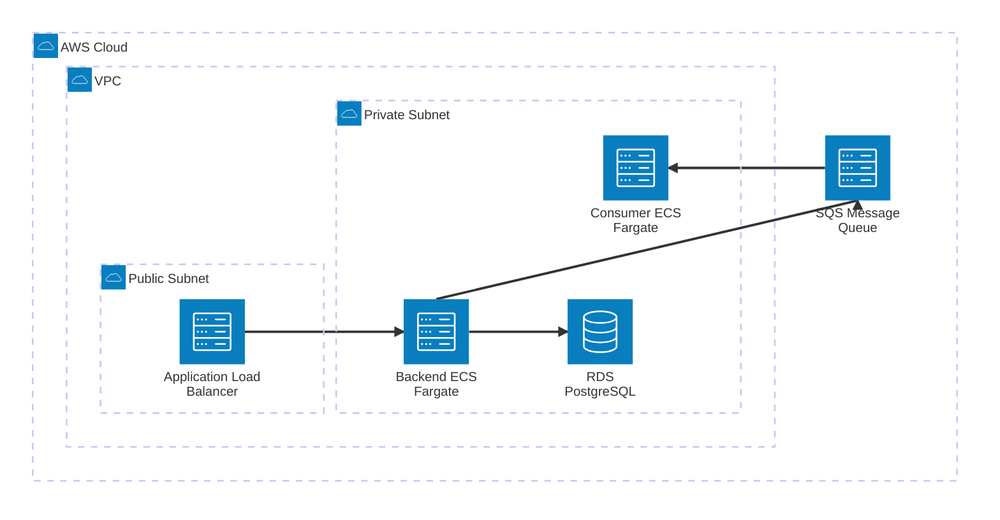

# Arquitectura, Diseño y Despliegue en AWS

La infraestructura y diseño de la aplicación se proyectan utilizando un modelo Cloud-Native Serverless y Arquitectura Hexagonal para garantizar la mantenibilidad, reproducibilidad y escalabilidad.

## 1. Decisiones de Arquitectura de Software

Antes de detallar el despliegue en la nube, es fundamental entender el "por qué" de las decisiones de diseño a nivel de código:

- **Arquitectura Hexagonal (Ports & Adapters):**
  Elegimos Arquitectura Hexagonal porque el requerimiento exige una solución mantenible y preparada para integrarse con "otros sistemas" a futuro. Esta arquitectura aísla la lógica core del negocio (Dominio y Casos de Uso) de los detalles técnicos y herramientas (Base de datos PostgreSQL, Framework web FastAPI, Colas de mensajes). Gracias a esto, si a futuro decidimos migrar a otro motor de base de datos o cambiar de framework, el núcleo de la aplicación permanecerá intacto, ya que la comunicación ocurre a través de contratos (interfaces/puertos).

- **Estrategia de Pruebas Unitarias (Enfoque en Casos de Uso):**
  Los tests unitarios no prueban las entidades o modelos de forma aislada y anémica. Siguiendo las prácticas modernas de desarrollo y diseño de software, los tests atacan directamente los **Casos de Uso**. El caso de uso es la capa que orquesta las entidades, aplica las reglas del negocio y coordina con los repositorios. Testear a este nivel asegura que estamos probando el *comportamiento y las reglas de negocio reales* que aportan valor al usuario, y no simplemente testeando el estado interno de un objeto de Python. Además, nos permite inyectar dependencias simuladas (Mocks) para probar escenarios complejos como la concurrencia.

- **Modelado Cloud-Native Serverless:**
  En lugar de usar servidores EC2 tradicionales, se optó por AWS Fargate (Serverless). Esto remueve la carga operativa de parchear y administrar sistemas operativos. Junto con el uso de **SQS** para desacoplar procesos pesados (como simuladores o envío de correos), nos aseguramos de que los picos de tráfico en la creación de solicitudes no saturen el procesamiento HTTP, garantizando resiliencia y alta disponibilidad.

## 2. Diagrama de Infraestructura AWS

El siguiente diagrama detalla cómo interactúan los componentes en la nube de AWS:



## 3. Gestión de Tráfico y Balanceo de Carga

### Application Load Balancer (ALB) y Target Groups
- El tráfico proveniente de internet llega inicialmente al **ALB** ubicado en la subred pública.
- El ALB distribuye las peticiones HTTP a los contenedores del Backend alojados en la subred privada.
- **Target Group:** Se configura un *Target Group* apuntando a los contenedores Fargate del backend en el puerto 8000. El ALB utiliza el endpoint `/api/v1/health/ready` para realizar los *Health Checks*. Si un contenedor falla, el ALB deja de enviarle tráfico y ECS lo reemplaza.

### CORS y Rate Limiting
- **CORS (Cross-Origin Resource Sharing):** La configuración de CORS se maneja a nivel de aplicación (FastAPI a través de `CORSMiddleware`) permitiendo solo los orígenes confiables del frontend.
- **Rate Limiting:** Para proteger la API de saturación y ataques (DDoS), se debe configurar **AWS WAF (Web Application Firewall)** asociado al ALB con una regla que restrinja el número máximo de peticiones por IP en un margen de tiempo.

## 4. Reglas de Acceso (Security Groups)

Aplicamos el principio de menor privilegio en la red:

- **ALB Security Group:** 
  - **Inbound:** Permite tráfico HTTP/HTTPS desde *Cualquier lugar (0.0.0.0/0)*.
  - **Outbound:** Solo permite tráfico hacia el Security Group del Backend.
- **Backend Security Group (ECS):**
  - **Inbound:** Permite tráfico en el puerto 8000 proveniente **exclusivamente** del ALB. Sin exposición a internet directo.
  - **Outbound:** Tráfico hacia el *RDS Security Group* en el puerto 5432 y salida a internet (vía NAT Gateway) para conectar con SQS.
- **RDS PostgreSQL Security Group:**
  - **Inbound:** Tráfico TCP en el puerto 5432 proveniente **únicamente** del *Backend Security Group*.

## 5. Estrategia de Escalabilidad

- **Capa de Cómputo (Backend HTTP):** 
  Utiliza **Application Auto Scaling**. Si el uso promedio de CPU/Memoria excede el 70% durante 2 minutos, Fargate aprovisiona más contenedores dinámicamente (Scale-Out) y los registra en el ALB. Cuando la carga disminuye, remueve las instancias (Scale-In).
- **Capa Asíncrona (Consumer Worker):**
  La escalabilidad del consumidor se mide por la **longitud de la cola SQS**. Si hay un pico masivo de mensajes pendientes por procesar, AWS levanta múltiples *Workers* en paralelo para vaciar la cola rápidamente, operando de manera independiente a la API principal.
- **Base de Datos (Amazon RDS):**
  Desplegada en configuración **Multi-AZ** para conmutación por error automática (Failover) en caso de caída del servidor principal. Para escalar las lecturas de los analistas, se pueden añadir *Read Replicas*.

## 6. Seguridad: Autenticación vs Autorización

En el diseño y evolución futura, estos conceptos cumplen roles separados:

- **Autenticación (AuthN):** Responde a *"¿Quién eres?"*. Verificar la identidad del usuario que hace la solicitud, típicamente conectando la API con Amazon Cognito o validando tokens JWT externos.
- **Autorización (AuthZ):** Responde a *"¿Tienes permiso para esto?"*. Una vez que sabemos quién es el usuario, el backend valida sus roles (ej. `ADMIN`, `SUPPORT`). Esto asegura que un usuario regular solo pueda crear solicitudes, mientras que un agente de soporte puede transicionar el estado a 'procesado'.

## 7. Instrucciones de Despliegue (CDK)

El código de infraestructura se encuentra en `infrastructure/aws`.

### Prerrequisitos
- AWS CLI configurado (`aws configure`).
- Instalar Node.js y CDK globalmente: `npm install -g aws-cdk`.
- Python 3.12+

### Pasos para Desplegar
1. Instalar dependencias:
   ```bash
   cd infrastructure/aws
   python -m venv .venv
   source .venv/bin/activate
   pip install -r requirements.txt
   ```
2. Ejecutar `cdk bootstrap` (una sola vez por cuenta).
3. Desplegar con `cdk deploy`. Al terminar, mostrará la URL pública de la API en el Load Balancer.
