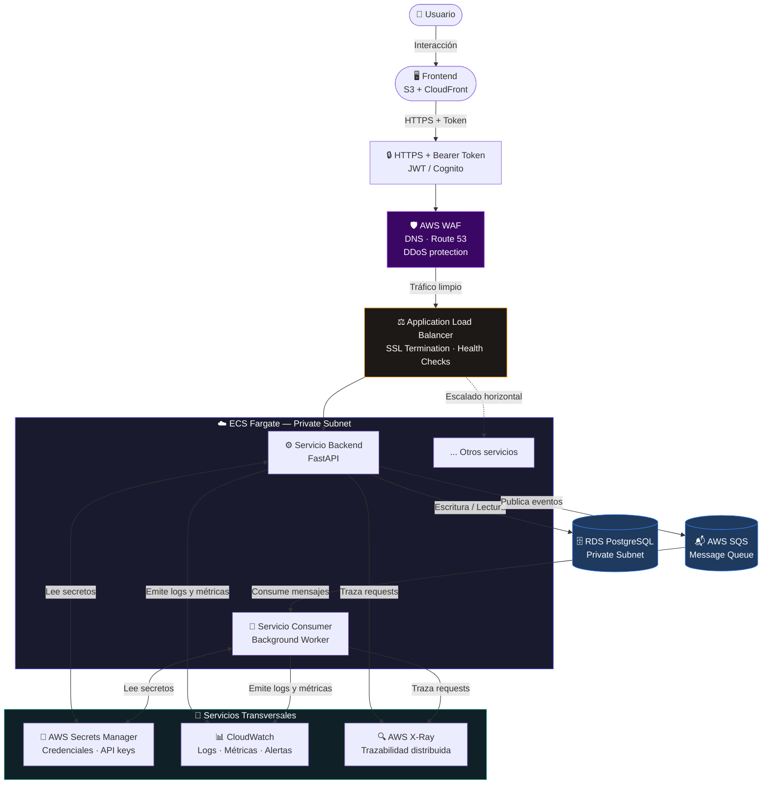

# Arquitectura y Despliegue en AWS (IaC)

La infraestructura de la aplicación está definida como código (Infrastructure as Code) utilizando **AWS CDK con Python**. Esto asegura que el despliegue sea reproducible, seguro y escalable.

## Flujograma de Arquitectura

El siguiente diagrama muestra el flujo completo de una solicitud desde el usuario hasta la capa de datos, incluyendo los controles de seguridad y observabilidad transversales.



### Descripción de Componentes

| Capa | Componente AWS | Responsabilidad |
|------|---------------|-----------------|
| **Presentación** | S3 + CloudFront | Sirve el frontend estático con CDN global |
| **Autenticación** | Amazon Cognito / JWT | Emite y valida tokens de acceso |
| **Protección perimetral** | Route 53 + AWS WAF | DNS, protección DDoS y filtrado de tráfico malicioso |
| **Balanceo** | Application Load Balancer | Termina SSL y distribuye tráfico entre tareas ECS |
| **Cómputo** | ECS Fargate | Ejecuta los servicios como contenedores serverless |
| **Mensajería** | AWS SQS | Desacopla el backend del worker (reemplaza RabbitMQ) |
| **Base de datos** | RDS PostgreSQL | Base de datos gestionada en subred privada |
| **Secretos** | AWS Secrets Manager | Almacena credenciales de BD, API keys y tokens |
| **Observabilidad** | CloudWatch | Centraliza logs, métricas y alarmas |
| **Trazabilidad** | AWS X-Ray | Rastrea el flujo de cada request entre servicios |

---

## Instrucciones de Despliegue (CDK)

El código de infraestructura se encuentra en la carpeta `infrastructure/aws`.

### Prerrequisitos
- AWS CLI configurado (`aws configure`)
- Node.js instalado + CDK global: `npm install -g aws-cdk`
- Python 3.12+

### Pasos para Desplegar

1. Crear el entorno virtual e instalar dependencias:
   ```bash
   cd infrastructure/aws
   python -m venv .venv
   source .venv/bin/activate  # Windows: .venv\Scripts\activate
   pip install -r requirements.txt
   ```

2. Bootstrap de CDK (una sola vez por cuenta/región):
   ```bash
   cdk bootstrap
   ```

3. Revisar los cambios antes de aplicar:
   ```bash
   cdk diff
   ```

4. Desplegar la infraestructura completa:
   ```bash
   cdk deploy
   ```

Al finalizar, CDK imprime el **Endpoint del Load Balancer** (URL pública de la API).
