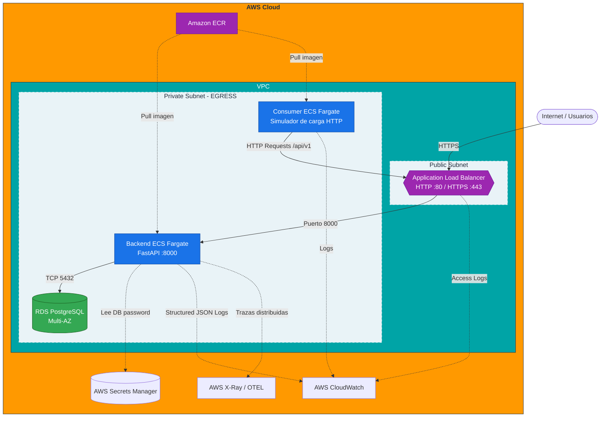

# Arquitectura, Diseño y Despliegue en AWS

La infraestructura y diseño de la aplicación se proyectan utilizando un modelo Cloud-Native Serverless y Arquitectura Hexagonal para garantizar la mantenibilidad, reproducibilidad y escalabilidad.

## 1. Decisiones de Arquitectura de Software

Antes de detallar el despliegue en la nube, es fundamental entender el "por qué" de las decisiones de diseño a nivel de código:

- **Arquitectura Hexagonal (Ports & Adapters):**
  Elegí Arquitectura Hexagonal porque el requerimiento exige una solución mantenible y preparada para integrarse con "otros sistemas" a futuro. Esta arquitectura aísla la lógica core del negocio (Dominio y Casos de Uso) de los detalles técnicos y herramientas (Base de datos PostgreSQL, Framework web FastAPI, Colas de mensajes). Gracias a esto, si a futuro decidí migrar a otro motor de base de datos o cambiar de framework, el núcleo de la aplicación permanecerá intacto, ya que la comunicación ocurre a través de contratos (interfaces/puertos).

- **Estrategia de Pruebas Unitarias (Enfoque en Casos de Uso):**
  Los tests unitarios no prueban las entidades o modelos de forma aislada y anémica. Siguiendo las prácticas modernas de desarrollo y diseño de software, los tests atacan directamente los **Casos de Uso**. El caso de uso es la capa que orquesta las entidades, aplica las reglas del negocio y coordina con los repositorios. Testear a este nivel asegura que estoy probando el *comportamiento y las reglas de negocio reales* que aportan valor al usuario, y no simplemente testeando el estado interno de un objeto de Python. Además, me permite inyectar dependencias simuladas (Mocks) para probar escenarios complejos como la concurrencia.

### Monitoreo (Opcional - pero recomendado)
- Habilitar métricas detalladas en el ALB, RDS, ECS y SQS mediante **CloudWatch**.
- Usar **X-Ray** para tracing de las peticiones entre ALB -> ECS -> RDS / SQS -> ECS.

### Mejoras Adicionales de Seguridad y Operación
- **Healthchecks Seguros:** Configurar healthchecks exhaustivos (deep healthchecks) tanto a nivel de ALB como a nivel de base de datos para asegurar el correcto funcionamiento end-to-end.
- **Registro de Imágenes (ECR):** Utilizar Amazon Elastic Container Registry (ECR) con escaneo de vulnerabilidades (Trivy/Clair) integrado antes del despliegue en ECS.
- **Certificados SSL (ACM):** Añadir un Amazon Certificate Manager (ACM) al Application Load Balancer para asegurar que toda la comunicación HTTPS está cifrada en tránsito.
- **IAM Least Privilege:** Ajustar roles IAM separando explícitamente `task_role` (acceso a AWS, RDS, SQS) del `execution_role` (pull ECR, CloudWatch Logs).
- **Estrategia de Reversión (Rollback):** Configurar AWS CodeDeploy (Blue/Green) para los servicios de ECS, permitiendo una rápida recuperación (rollback) si los monitores de CloudWatch detectan un error.

- **Modelado Cloud-Native Serverless:**
  En lugar de usar servidores EC2 tradicionales, se optó por AWS Fargate (Serverless). Esto remueve la carga operativa de parchear y administrar sistemas operativos. El consumidor HTTP se ejecuta independientemente y simula el tráfico de peticiones para asegurar resiliencia y pruebas de carga constantes.

## 2. Diagrama de Infraestructura AWS

El siguiente diagrama detalla cómo interactúan los componentes en la nube de AWS:



## 3. Gestión de Tráfico y Balanceo de Carga

### Application Load Balancer (ALB) y Target Groups
- El tráfico proveniente de internet llega inicialmente al **ALB** ubicado en la subred pública.
- El ALB distribuye las peticiones HTTP a los contenedores del Backend alojados en la subred privada.
- **Target Group:** Se configura un *Target Group* apuntando a los contenedores Fargate del backend en el puerto 8000. El ALB utiliza el endpoint `/health` para realizar los *Health Checks*. Si un contenedor falla, el ALB deja de enviarle tráfico y ECS lo reemplaza. Todas las peticiones HTTP son ruteadas por defecto a la API sin necesidad de reglas de reescritura, exponiendo correctamente los endpoints `/api/v1/requests`.

### CORS y Rate Limiting
- **CORS (Cross-Origin Resource Sharing):** La configuración de CORS se maneja a nivel de aplicación (FastAPI a través de `CORSMiddleware`) permitiendo solo los orígenes confiables del frontend.
- **Rate Limiting:** Para proteger la API de saturación y ataques (DDoS), se debe configurar **AWS WAF (Web Application Firewall)** asociado al ALB con una regla que restrinja el número máximo de peticiones por IP en un margen de tiempo.

## 4. Reglas de Acceso (Security Groups)

Apliqué el principio de menor privilegio en la red:

- **ALB Security Group:** 
  - **Inbound:** Permite tráfico HTTP/HTTPS desde *Cualquier lugar (0.0.0.0/0)*.
  - **Outbound:** Solo permite tráfico hacia el Security Group del Backend.
- **Backend Security Group (ECS):**
  - **Inbound:** Permite tráfico en el puerto 8000 proveniente **exclusivamente** del ALB. Sin exposición a internet directo.
  - **Outbound:** Tráfico hacia el *RDS Security Group* en el puerto 5432 y salida para telemetría.
- **RDS PostgreSQL Security Group:**
  - **Inbound:** Tráfico TCP en el puerto 5432 proveniente **únicamente** del *Backend Security Group*.

## 5. Estrategia de Escalabilidad

- **Capa de Cómputo (Backend HTTP):** 
  Utiliza **Application Auto Scaling**. Si el uso promedio de CPU/Memoria excede el 70% durante 2 minutos, Fargate aprovisiona más contenedores dinámicamente (Scale-Out) y los registra en el ALB. Cuando la carga disminuye, remueve las instancias (Scale-In).
- **Capa Asíncrona / Simulación (Consumer):**
  La escalabilidad del consumidor puede ajustarse lanzando múltiples tareas Fargate en paralelo para simular tráfico pesado y probar los límites del Load Balancer y la API principal.

### 5.4. HTTPS y Certificados (ACM)
Para garantizar el cifrado en tránsito, el **Application Load Balancer (ALB)** tendrá asociado un certificado SSL/TLS gestionado por **AWS Certificate Manager (ACM)**. El ALB terminará la conexión HTTPS y reenviará el tráfico al backend (ECS Fargate) a través de HTTP por la VPC privada.

### 5.5. IAM (Identity and Access Management)
El principio de mínimo privilegio regirá la comunicación:
- **Task Execution Role (ECS)**: Permiso para que ECS extraiga imágenes de ECR y escriba logs en CloudWatch.
- **Task Role (Consumer)**: Principio de Menor Privilegio estricto. **No tiene acceso** a lectura de credenciales ni a la Base de Datos. Solo posee permisos para ejecutar llamadas HTTP y emitir logs en CloudWatch, previniendo exposición cruzada de secretos.

## 6. Estrategia de Reversión y Alertas (Resiliencia Adicional)

### 6.1. Estrategia de Reversión (Rollback)
Dado que uso ECS Fargate, el despliegue usará **ECS Rolling Update**:
1. Se levantan las nuevas tareas (vN).
2. Se registran en el Target Group del ALB.
3. Se verifican los Health Checks.
4. Si los Health Checks fallan repetidamente, ECS detiene las tareas vN y el tráfico sigue hacia la vN-1 sin interrupción.

### 6.2. Alertas y Monitoreo Proactivo
Se configurarán **CloudWatch Alarms** vinculadas a un tópico SNS para notificar al equipo vía email/Slack en los siguientes casos:
1. **Errores 5xx del ALB**: Si la tasa de errores supera el 1% en un período de 5 minutos.
2. **CPU/Memoria de Fargate**: Si el uso supera el 80% sostenido por 10 minutos (indicador de que el auto-scaling no está dando abasto o hay un leak).
3. **Estado de la BD (RDS)**: Si el uso de CPU > 90% o las conexiones concurrentes se acercan al límite máximo.

## 6. Seguridad: Autenticación vs Autorización

En el diseño y evolución futura, estos conceptos cumplen roles separados:

- **Autenticación (AuthN):** Responde a *"¿Quién eres?"*. Verificar la identidad del usuario que hace la solicitud, típicamente conectando la API con Amazon Cognito o validando tokens JWT externos.
- **Autorización (AuthZ):** Responde a *"¿Tienes permiso para esto?"*. Una vez que sabemos quién es el usuario, el backend valida sus roles (ej. `ADMIN`, `SUPPORT`). Esto asegura que un usuario regular solo pueda crear solicitudes, mientras que un agente de soporte puede transicionar el estado a 'procesado'.

### Gestión de Credenciales y Secretos
- **AWS Secrets Manager:** Nunca se hardcodean credenciales. La contraseña maestra de la base de datos PostgreSQL se autogenera y almacena cifrada (KMS) en Secrets Manager. 
- **Inyección en Tiempo de Ejecución (ECS):** En lugar de inyectar las credenciales como variables de entorno de texto plano (vulnerabilidad *OWASP A02: Secrets Exposure*), la definición de contenedores (Task Definition) mapea el ARN del secreto para que el agente ECS resuelva la credencial directamente en la memoria del contenedor de forma dinámica, manteniendo la consola y el código fuente libres de información sensible.

> **Defensa Técnica (OWASP):** *"Cualquier información sensible, como la clave maestra de PostgreSQL, se almacena en Secrets Manager. Uso el mapeo nativo de ECS para inyectar credenciales directamente a los contenedores, evitando exponerlas en variables de entorno estáticas y previniendo la vulnerabilidad de exposición de secretos (OWASP A02)"*.

## 7. Instrucciones de Despliegue (CDK)

El código de infraestructura se encuentra en `infrastructure/aws`.

### Prerrequisitos
- AWS CLI configurado (`aws configure`).
- Instalar Node.js y CDK globalmente: `npm install -g aws-cdk`.
- Python 3.12+

### Pasos para Desplegar
1. Instalar dependencias:
   ```bash
   cd infrastructure/aws
   python -m venv .venv
   source .venv/bin/activate
   pip install -r requirements.txt
   ```
2. Ejecutar `cdk bootstrap` (una sola vez por cuenta).
3. Desplegar con `cdk deploy`. Al terminar, mostrará la URL pública de la API en el Load Balancer.
