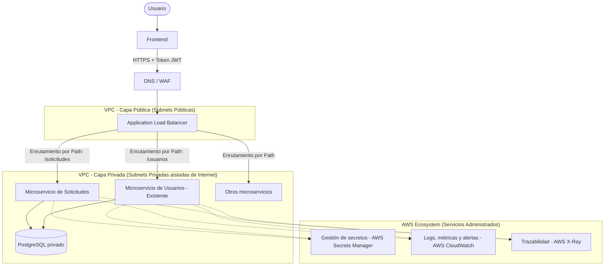

# Propuesta de Implementación en AWS

## 1. Flujograma de Arquitectura

De acuerdo a los lineamientos requeridos, la arquitectura sigue un modelo estricto de separación de responsabilidades y redes (VPC), integrando el nuevo servicio dentro del ecosistema existente.

---

## 2. Servicios de AWS Seleccionados y Justificación

### Ejecución y Almacenamiento de Contenedores
- **Amazon ECR (Elastic Container Registry):** Se utilizará para almacenar las imágenes Docker generadas en el pipeline CI/CD. Es privado, encriptado e integrado nativamente con IAM y ECS.
- **Amazon ECS con AWS Fargate:** Los servicios se ejecutarán en Fargate (Serverless Compute para contenedores).
  - *Justificación:* No administramos instancias EC2. Pagamos solo por los recursos (vCPU/RAM) que consumen los contenedores y facilita el auto-escalado horizontal basado en carga.

### Punto de Entrada y Enrutamiento (ALB y WAF)
- **Application Load Balancer (ALB):** Actuará como punto único de entrada.
  - *Configuración:* Tendrá un **Listener en el puerto 443 (HTTPS)** con un certificado SSL/TLS gestionado por **AWS Certificate Manager (ACM)**.
  - *Target Groups:* Se configurará un Target Group por cada microservicio. Los *Health Checks* apuntarán al endpoint `/health` de cada API. Si Fargate levanta un contenedor y falla el health check, el ALB no le envía tráfico.
  - *Enrutamiento:* Reglas de Path-based routing. Ej: Tráfico a `/solicitudes/*` va al Target Group del **Microservicio de Solicitudes**.
- **AWS WAF (Web Application Firewall):** Asociado al ALB.
  - *Problema que resuelve:* Configuración de **Rate Limiting** (ej. máximo 500 peticiones por minuto por IP) y protección contra inyecciones SQL/XSS, bloqueando tráfico malicioso antes de que golpee al balanceador.

### Segmentación de Red y Reglas de Acceso (Security Groups)
La arquitectura se despliega en una **VPC (Virtual Private Cloud)** con segmentación estricta:
1. **ALB (Capa Pública):** 
   - *Security Group:* Permite tráfico entrante (Inbound) SOLO en puerto 443 (HTTPS) desde cualquier IP `0.0.0.0/0`.
2. **Servicios Backend ECS (Capa Privada):**
   - *Restricción:* NO tienen IP pública. No son accesibles desde Internet.
   - *Security Group:* Permite Inbound SOLO en puerto 8000 proveniente **exclusivamente del Security Group del ALB**. 
3. **Amazon RDS PostgreSQL (Capa de Datos Privada):**
   - *Restricción:* Completamente aislado.
   - *Security Group:* Permite Inbound SOLO en puerto 5432 proveniente **exclusivamente de los Security Groups de los servicios Backend** que lo requieran (Aplicando el Principio de Mínimo Privilegio a nivel red).

### Autenticación y Autorización
- **Usuarios desde Frontend:** Se utilizará **Amazon Cognito** (u otro IdP) para generar tokens JWT. El frontend adjunta el token en el header `Authorization`.
- **Validación en Backend:** La validación real del JWT recae sobre el código de cada servicio backend (FastAPI Dependency), garantizando que *la autorización se valide en cada servicio* según el requerimiento. (Alternativamente, el ALB puede configurarse con autenticación OIDC para filtrar tokens antes de rutarlos, pero el backend igual debe verificar los scopes/permisos de ese usuario).
- **Autenticación entre servicios (M2M):** Si el Microservicio de Solicitudes necesita hablar con otros microservicios, se pueden utilizar tokens firmados internamente (M2M tokens) o aprovechar **AWS App Mesh** (Service Mesh) para establecer mTLS (Mutual TLS) automático entre contenedores.

### Gestión de Secretos, Logs y Trazabilidad
- **AWS Secrets Manager:** 
  - *Justificación:* Las credenciales (usuario/password de DB) **jamás** se exponen en variables de entorno fijas ni en imágenes. La definición de la tarea (Task Definition) de ECS inyectará los secretos dinámicamente desde Secrets Manager como variables de entorno al contenedor en tiempo de ejecución. Solo el rol IAM del servicio tiene permiso (`secretsmanager:GetSecretValue`) para leer su propio secreto (Mínimo Privilegio).
- **Amazon CloudWatch:**
  - *Logs:* Los logs estructurados en JSON que escupe el contenedor son enviados a **CloudWatch Logs** mediante el log driver `awslogs`. Al ser JSON, podemos crear consultas (Log Insights), métricas y generar alertas (Alarmas de SNS) si se detectan errores `ERROR` recurrentes.
- **AWS X-Ray:** 
  - *Trazabilidad:* Se instrumenta el SDK en Python para que un `trace_id` viaje a través de todas las peticiones, permitiendo ver gráficamente cuánto tardó el ALB, cuánto tardó el backend y cuánto tardó la query a PostgreSQL.

### Estrategia de Escalabilidad, Despliegue y Reversión
- **Escalabilidad (Application Auto Scaling):** Se configuran políticas de escalado para que ECS añada nuevos contenedores (tasks) si el uso de CPU promedio supera el 70% o si la cantidad de peticiones concurrentes por contenedor aumenta (ALB Request Count).
- **Despliegue (Rolling Update):** En un CI/CD (ej. GitHub Actions -> ECS), el despliegue es "Rolling". ECS levanta un nuevo contenedor con la v2. El ALB le hace Health Check. Solo si devuelve `200 OK`, el ALB redirige tráfico allí y luego mata la v1. 
- **Reversión de Versiones (Rollback):** Si la v2 está rota y falla el health check, ECS cancela automáticamente el despliegue y mantiene intacta la v1, garantizando **Zero Downtime**.
- **CORS:** Manejado directamente a nivel de código en el backend (FastAPI CORSMiddleware), permitiendo solo el origen (Origin) del Frontend oficial.
