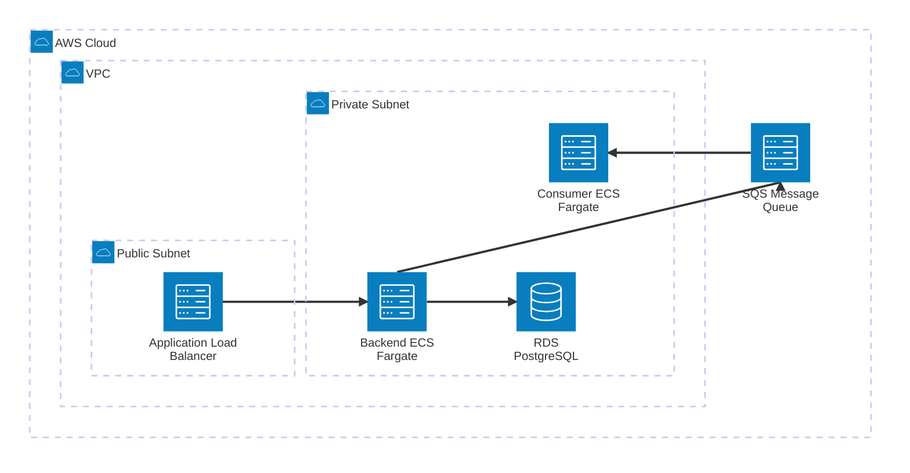

# Arquitectura y Despliegue en AWS (IaC)

La infraestructura de la aplicación está definida como código (Infrastructure as Code) utilizando **AWS CDK con Python**. Esto asegura que el despliegue sea reproducible, seguro y escalable.

## Diagrama de Arquitectura

El siguiente diagrama detalla cómo los componentes interactúan en la nube de AWS:



### Componentes:
1. **Application Load Balancer (ALB):** Recibe el tráfico HTTP de internet y lo distribuye entre las tareas del Backend.
2. **Backend ECS Fargate:** Ejecuta la API de FastAPI de manera Serverless, escalando según el tráfico sin necesidad de administrar servidores EC2.
3. **Consumer ECS Fargate:** Tarea en background encargada de leer los eventos y procesar el envío de correos asíncrono.
4. **RDS PostgreSQL:** Base de datos gestionada, ubicada en subredes privadas para máxima seguridad.
5. **AWS SQS:** Cola de mensajes totalmente administrada, reemplaza a RabbitMQ para un entorno Cloud-native, desacoplando el backend del consumer.

## Instrucciones de Despliegue (CDK)

El código de infraestructura se encuentra en la carpeta `infrastructure/aws`.

### Prerrequisitos
- Tener AWS CLI configurado (`aws configure`).
- Instalar Node.js y luego instalar CDK globalmente: `npm install -g aws-cdk`.
- Python 3.12+

### Pasos para Desplegar

1. Instalar las dependencias de CDK:
   ```bash
   cd infrastructure/aws
   python -m venv .venv
   source .venv/bin/activate  # En Windows: .venv\Scripts\activate
   pip install -r requirements.txt
   ```

2. Bootstrapping de AWS CDK (una sola vez por cuenta):
   ```bash
   cdk bootstrap
   ```

3. Revisar los cambios que se van a aplicar:
   ```bash
   cdk diff
   ```

4. Desplegar la infraestructura:
   ```bash
   cdk deploy
   ```

Al finalizar el despliegue, la terminal de CDK mostrará el **Endpoint del Load Balancer** (la URL pública de la API).
