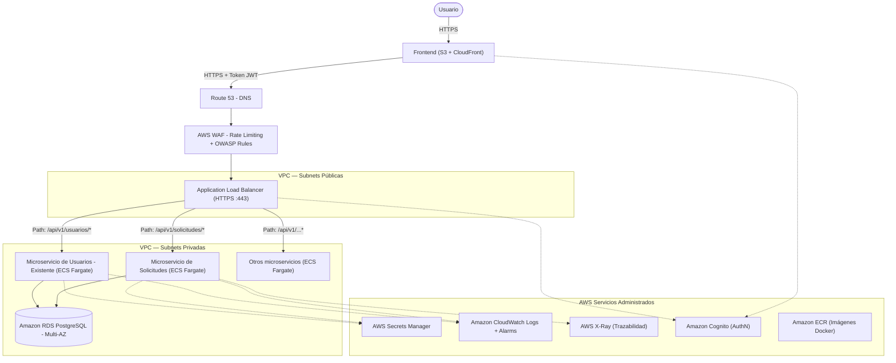

# Propuesta de Implementación en AWS

## 1. Flujograma de Arquitectura

La arquitectura sigue un modelo estricto de separación de responsabilidades y redes (VPC), integrando el nuevo microservicio de solicitudes dentro del ecosistema existente que ya cuenta con un frontend y otros servicios backend.

---

## 2. Servicios AWS Seleccionados y Justificación

### Ejecución y Almacenamiento de Contenedores

**Amazon ECR (Elastic Container Registry)**
Las imágenes Docker del backend y del consumidor se almacenan en ECR. Es privado, encriptado con KMS y tiene integración nativa con IAM y ECS. El pipeline CI/CD (GitHub Actions) hace `docker build`, `docker push` a ECR y luego actualiza el servicio ECS.

**Amazon ECS con AWS Fargate**
Los servicios corren en Fargate (serverless compute para contenedores). No se administran instancias EC2. Se paga solo por vCPU/RAM consumidos por cada task. El auto-escalado horizontal se configura con Application Auto Scaling basado en CPU promedio o número de peticiones concurrentes en el Target Group del ALB.

---

### Punto de Entrada — ALB, WAF y DNS

**AWS Route 53**
Maneja el DNS del dominio. Redirige el tráfico al ALB mediante un alias record. Soporta health checks propios para failover geográfico si se requiere en el futuro.

**AWS WAF (Web Application Firewall)**
Asociado al ALB. Resuelve dos problemas concretos:
- **Rate Limiting:** máximo N peticiones por IP por minuto. Bloquea bots y ataques de fuerza bruta.
- **Protección OWASP:** reglas administradas contra SQLi, XSS y otras vulnerabilidades, sin escribir una sola línea de código en el backend.

**Application Load Balancer (ALB)**
Actúa como único punto de entrada público.
- **Listener en el puerto 443 (HTTPS):** el certificado SSL/TLS está gestionado por AWS Certificate Manager (ACM), renovación automática.
- **Listener en el puerto 80:** redirige permanentemente (301) a HTTPS.
- **Target Groups:** uno por microservicio. Los health checks apuntan al endpoint `/health` de cada API. Si un contenedor no responde `200 OK`, el ALB no le envía tráfico hasta que se recupere.
- **Enrutamiento por Path:** `/api/v1/solicitudes/*` → Target Group del microservicio de solicitudes. `/api/v1/usuarios/*` → Target Group del microservicio de usuarios. Permite agregar nuevos servicios sin cambiar los existentes.

---

### Segmentación de Red y Security Groups

La VPC tiene cuatro tipos de subnets:

| Subnet | Qué vive ahí | Reglas de entrada |
|---|---|---|
| Pública | ALB | Solo puerto 443 desde `0.0.0.0/0` |
| Privada - Aplicación | ECS Tasks (todos los servicios) | Solo desde el Security Group del ALB, en el puerto de la app (8000) |
| Privada - Datos | Amazon RDS PostgreSQL | Solo desde los Security Groups de los servicios que necesitan DB, en puerto 5432 |
| Privada - Gestión | AWS Secrets Manager (endpoint VPC) | Solo desde los Security Groups de los servicios autorizados |

RDS nunca tiene IP pública. Los servicios ECS nunca tienen IP pública. Solo el ALB está en la subnet pública.

---

### Autenticación y Autorización

**Usuarios desde el Frontend**
El frontend autentica usuarios contra **Amazon Cognito** (User Pool), que emite tokens JWT (id token + access token). El frontend adjunta el access token en el header `Authorization: Bearer <token>`.

Validación en dos capas:
1. **ALB** puede configurarse con autenticación OIDC para rechazar peticiones sin token válido antes de que lleguen al backend (capa de defensa perimetral).
2. **Cada servicio FastAPI** valida el token en un `Depends()`, verificando la firma, el `exp`, el `aud` y los scopes del usuario. La autorización **siempre se valida en el servicio**, no se confía solo en el ALB.

**Comunicación entre servicios (M2M)**
Los microservicios internos se comunican usando tokens M2M de **Cognito (Client Credentials flow)** o mediante IAM Task Roles con permisos mínimos. No hay credenciales hardcodeadas. Se puede escalar a **AWS App Mesh + mTLS** si la complejidad del ecosistema lo justifica.

---

### Gestión de Secretos

**AWS Secrets Manager**
Las credenciales de la base de datos (`POSTGRES_PASSWORD`, `DATABASE_URL`) y otros secretos **jamás se almacenan** en el código, en imágenes Docker ni en variables de entorno estáticas de la Task Definition.

Funcionamiento:
1. En la Task Definition de ECS, se referencia el ARN del secreto en Secrets Manager.
2. Al arrancar el contenedor, ECS inyecta el secreto como variable de entorno en tiempo de ejecución.
3. Solo el IAM Task Role del servicio tiene permiso `secretsmanager:GetSecretValue` para su propio secreto (mínimo privilegio).
4. La rotación de credenciales se puede automatizar desde Secrets Manager sin redeploy del servicio.

---

### Observabilidad: Logs, Métricas y Trazabilidad

**Amazon CloudWatch Logs**
Los contenedores emiten logs estructurados en JSON (ya implementado en el backend con `JSONFormatter`). ECS usa el log driver `awslogs` para enviarlos a CloudWatch Logs automáticamente. Al ser JSON, se pueden construir:
- **Log Insights queries** para buscar por `solicitud_id`, `status_code` o `duration_ms`.
- **Métricas personalizadas** derivadas de logs (ej: tasa de errores 5xx).
- **CloudWatch Alarms** que disparan notificaciones SNS si el error rate supera un umbral.

**AWS X-Ray**
Se integra el SDK de Python (`aws-xray-sdk`) en el backend FastAPI. Cada petición genera un `trace_id` que viaja a través de ALB → Backend → RDS, permitiendo ver visualmente cuánto tiempo tomó cada segmento y dónde está el cuello de botella.

---

### Escalabilidad, Despliegue y Reversión

**Application Auto Scaling**
Se configura una política de escalado que agrega nuevas tasks ECS si:
- CPU promedio del servicio supera el 70%.
- Request count por task en el ALB supera un umbral definido.

El escalado es horizontal (más contenedores), sin downtime.

**CI/CD con Rolling Deployment (GitHub Actions → ECS)**
1. `pytest` corre en la pipeline; si falla, el deploy se cancela.
2. Se construye la imagen Docker y se pushea a ECR con un tag de Git SHA.
3. Se actualiza la Task Definition de ECS con la nueva imagen.
4. ECS hace un rolling update: levanta un contenedor nuevo, el ALB verifica el `/health`, y solo si responde `200 OK` se elimina el contenedor viejo.

**Rollback Automático**
Si el health check del nuevo contenedor falla durante el rolling update, ECS cancela automáticamente el deployment y mantiene la versión anterior corriendo. Zero downtime garantizado.

**CORS**
Configurado en el backend (`CORSMiddleware`) restringiendo `allow_origins` al dominio oficial del frontend en producción. No se acepta `*` en producción.

---

## 3. Restricciones Cumplidas

| Restricción | Solución |
|---|---|
| Backend y PostgreSQL no expuestos a Internet | Subnets privadas sin IP pública; solo el ALB en subnet pública |
| Acceso público solo por HTTPS | Listener 443 con ACM; listener 80 redirige a HTTPS |
| PostgreSQL en red privada | RDS en subnet de datos; Security Group solo acepta desde backend |
| Autorización validada en cada servicio | FastAPI `Depends()` valida JWT en cada endpoint |
| Credenciales fuera del código e imágenes | AWS Secrets Manager + IAM Task Roles |
| Mínimo privilegio por servicio | IAM Task Role por servicio con permisos específicos (solo su secreto, solo su log group) |
| Arquitectura extensible | Agregar servicio = nuevo Target Group en ALB + nueva Task Definition. Sin cambiar los servicios existentes. |
| Logs centralizados y solicitudes trazables | CloudWatch Logs + X-Ray trace ID por petición |
