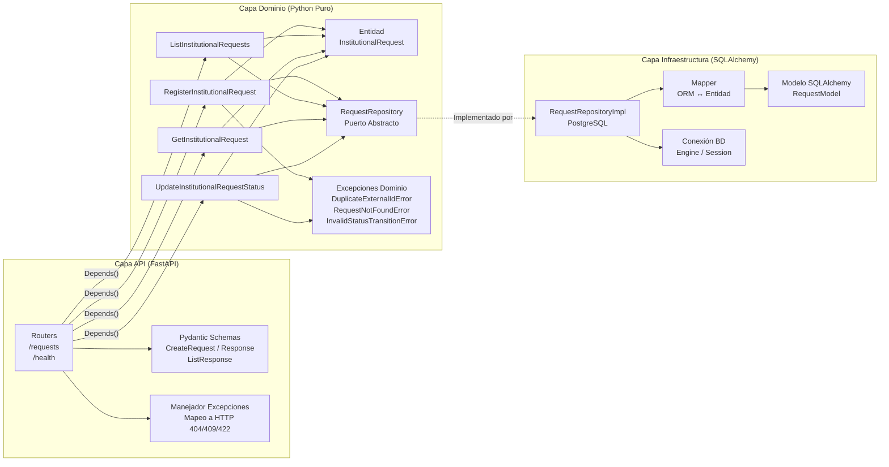

# Servicio de Backend para Solicitudes Institucionales

API REST para la gestión de solicitudes institucionales, construida con FastAPI y Arquitectura Hexagonal (Arquitectura Limpia). Completamente contenida con Docker Compose.

---

## 🚀 Inicio Rápido

**Prerrequisitos:** Tener Docker y Docker Compose instalados.

```bash
# 1. Clonar el repositorio
git clone <url-del-repositorio>
cd <directorio-del-repositorio>

# 2. Configurar variables de entorno
cp .env.example .env

# 3. Levantar todos los servicios (backend, base de datos, consumidor)
docker compose up --build
```

El stack arranca en el siguiente orden: **PostgreSQL → Backend (ejecuta migraciones con Alembic) → Consumer**.

| Servicio | URL |
|---|---|
| Swagger / OpenAPI | http://localhost:8000/docs |
| ReDoc | http://localhost:8000/redoc |
| Health check (Salud) | http://localhost:8000/health |

### Detener los servicios

```bash
docker compose down           # detiene los contenedores
docker compose down -v        # detiene y elimina el volumen de la base de datos
```

### Ver logs

```bash
docker compose logs -f              # todos los servicios
docker compose logs -f backend      # solo el backend
docker compose logs -f consumer     # solo el consumidor
```

---

## 🧪 Ejecución de Pruebas Unitarias

```bash
# Opción A: Dentro del contenedor en ejecución
docker compose exec backend pytest tests/ -v

# Opción B: Localmente (Requiere Python 3.12+, con pip install -r backend/requirements.txt)
cd <raíz-del-repositorio>
$env:DATABASE_URL="sqlite:///:memory:"  # En Windows PowerShell
pytest backend/tests -v
```

**La suite de pruebas incluye tests de concurrencia e integridad**. La cobertura abarca:

| Área | Pruebas |
|---|---|
| Validación de Schemas (Pydantic) | Payload válido, email inválido, valores fuera de catálogo, campos faltantes, limpieza de espacios |
| Casos de Uso (Lógica de Negocio) | Auto-ID, timestamps UTC, estado inicial, transiciones de estado, concurrencia |
| Repositorio (Manejo de Errores) | Intercepción de `IntegrityError` nativo simulado, manejo de `DuplicateExternalIdError` |
| Manejo de Duplicados | Rechaza duplicados mediante comprobación concurrente segura |
| Registros no encontrados | Lanza `RequestNotFoundError` en lectura y actualización |
| Endpoints de Salud | `/health` siempre activo, `/health/ready` con base de datos simulada |

---

## 📐 Arquitectura y Decisiones Técnicas

El diseño de esta solución fue pensado para ser mantenible, escalable y testable. Estos son los pilares arquitectónicos que se sustentan en este proyecto:

### 1. Arquitectura Hexagonal (Ports & Adapters)
Se optó por separar estrictamente la **Lógica de Negocio (Dominio y Casos de Uso)** de los **Detalles Técnicos (FastAPI, PostgreSQL, SQLAlchemy)**.
- **¿Por qué?** Permite que el sistema evolucione sin fricción. Si a futuro se decide cambiar el framework web o la base de datos, el núcleo de la aplicación (entidades y casos de uso) no sufrirá ninguna modificación porque se comunica a través de "puertos" (interfaces abstractas) implementados por "adaptadores".

### 2. Pruebas Unitarias Orientadas a Casos de Uso
En lugar de probar entidades anémicas de forma aislada, los tests unitarios están enfocados en los **Casos de Uso** (orquestadores). 
- **¿Por qué?** Probar el caso de uso garantiza que estamos validando el comportamiento y las reglas de negocio reales del sistema (ej: *crear una solicitud*, *actualizar un estado*), facilitando la inyección de repositorios simulados (Mocks) para probar escenarios críticos como la concurrencia.

### Diagrama de Capas



### Decisiones Clave Adicionales

| Decisión | Justificación |
|---|---|
| **Alembic (Migraciones)** | Las migraciones están versionadas y se ejecutan automáticamente al arrancar el contenedor (`entrypoint.sh`). |
| **Logs Estructurados (JSON)** | Formateador JSON a la medida emite `timestamp`, `service`, `method`, `endpoint`, `status_code`, `duration_ms`. 100% compatible con CloudWatch o Datadog. |
| **Integridad Concurrente** | El control de duplicidad se gestiona capturando la colisión nativa (`IntegrityError`) de la base de datos, protegiendo al sistema de "Condiciones de Carrera" (Race Conditions) y retornando 409 Conflict. |
| **Observabilidad** | Trazas distribuidas mediante la propagación de la cabecera `X-Request-ID` entre el Consumidor y el Backend, permitiendo correlacionar logs End-to-End. |
| **pydantic-settings** | Configuración inyectada 100% desde variables de entorno. Cero secretos en código. |

---

## 🔌 Endpoints

| Método | Ruta | Descripción |
|---|---|---|
| `POST` | `/api/v1/requests` | Crear una nueva solicitud |
| `GET` | `/api/v1/requests` | Listar solicitudes (`?status`, `?type`, `?priority`, `?limit`, `?offset`) |
| `GET` | `/api/v1/requests/{external_id}` | Obtener una solicitud por su UUID externo |
| `PATCH` | `/api/v1/requests/{external_id}/status` | Actualizar el estado de una solicitud |
| `GET` | `/health` | Chequeo de disponibilidad de la API |
| `GET` | `/health/ready` | Chequeo de conexión con PostgreSQL |

---

## ⚙️ Variables de Entorno

| Variable | Descripción | Por defecto |
|---|---|---|
| `DATABASE_URL` | Cadena de conexión completa a PostgreSQL | *(Requerido)* |
| `POSTGRES_USER` | Usuario de BD | `admin` |
| `POSTGRES_PASSWORD` | Contraseña de BD | *(Requerido)* |
| `POSTGRES_DB` | Nombre de la base de datos | `solicitudes_db` |
| `LOG_LEVEL` | Nivel de log (`DEBUG`, `INFO`, `WARNING`, `ERROR`) | `INFO` |
| `DEBUG` | Activa modo debug en FastAPI | `false` |
| `BACKEND_PORT` | Puerto expuesto para la API | `8000` |
| `DB_PORT` | Puerto expuesto para PostgreSQL | `5432` |

---

## ☁️ Propuesta de Despliegue en AWS

La justificación de los componentes en la nube (Load Balancer, Fargate, RDS, SQS, Reglas de Acceso y Estrategia de Escalabilidad) así como la configuración Serverless y Cloud-Native para soportar alta demanda se documentan detalladamente en el archivo:

👉 **[`AWS_PROPOSAL.md`](./AWS_PROPOSAL.md)**
