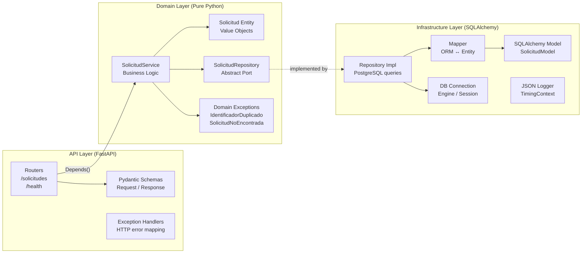

# Institutional Requests Backend Service

REST API for managing institutional requests, built with FastAPI and hexagonal (Clean) architecture. Fully containerized with Docker Compose.

---

## 🚀 Quickstart

**Prerequisites:** Docker and Docker Compose installed.

```bash
# 1. Clone the repository
git clone <repository-url>
cd <repository-directory>

# 2. Set up environment variables
cp .env.example .env

# 3. Start all services (backend, database, consumer)
docker compose up --build
```

The stack boots in this order: **PostgreSQL → Backend (runs Alembic migrations) → Consumer**.

| Service | URL |
|---|---|
| Swagger / OpenAPI | http://localhost:8000/docs |
| ReDoc | http://localhost:8000/redoc |
| Health check | http://localhost:8000/health |

### Stop the services

```bash
docker compose down           # stop containers
docker compose down -v        # stop and wipe the database volume
```

### View logs

```bash
docker compose logs -f              # all services
docker compose logs -f backend      # backend only
docker compose logs -f consumer     # consumer only
```

---

## 🧪 Running the Test Suite

```bash
# Option A: inside the running container
docker compose exec backend pytest tests/ -v

# Option B: locally (Python 3.11+ required, with pip install -r backend/requirements.txt)
cd <repository-root>
PYTHONPATH=backend DATABASE_URL=postgresql://... pytest backend/tests -v
```

**44 tests, 0 failures.** Coverage includes:

| Area | Tests |
|---|---|
| Schema validation (Pydantic) | Valid payload, invalid email, invalid catalog values, missing fields, whitespace cleanup |
| Domain entity | Auto-ID, UTC timestamps, initial state, state transitions |
| Domain service | Create, get, list with filters, update state |
| Duplicate handling | Rejects duplicates, does not persist |
| Not-found records | Raises `SolicitudNoEncontrada` on get and update |
| Health endpoints | `/health` always-up, `/health/ready` with mocked DB |

---

## 📐 Architecture & Technical Decisions

### Layer Diagram



### Layer Structure

```text
backend/
└── app/
    ├── api/
    │   ├── v1/
    │   │   ├── routers/        # FastAPI route handlers (solicitudes, health)
    │   │   └── schemas/        # Pydantic request/response models
    │   ├── dependencies.py     # Dependency injection (repository → service)
    │   └── exception_handlers.py  # Centralized HTTP error mapping
    ├── domain/
    │   ├── entities/           # Solicitud entity (pure Python, no ORM)
    │   ├── value_objects/      # Estado, Prioridad, TipoSolicitud enums
    │   ├── ports/              # SolicitudRepository abstract interface
    │   ├── services/           # Business logic (SolicitudService)
    │   └── exceptions.py       # Domain exceptions (IdentificadorDuplicado, SolicitudNoEncontrada)
    ├── infrastructure/
    │   ├── database/
    │   │   ├── connection.py   # SQLAlchemy engine, session, health check
    │   │   ├── models.py       # ORM model (SolicitudModel)
    │   │   ├── mapper.py       # Converts between ORM ↔ domain entity
    │   │   └── solicitud_repository_impl.py  # Concrete repository (PostgreSQL)
    │   └── logging/
    │       └── logger.py       # JSON structured logger + TimingContext
    ├── config.py               # pydantic-settings — all config from env vars
    └── main.py                 # FastAPI app factory, middleware, router registration
migrations/                     # Alembic migration scripts
tests/
└── unit/
    ├── api/                    # Schema and health endpoint tests
    └── domain/                 # Entity and service tests (fully mocked, no DB)
```

### Key Decisions

| Decision | Rationale |
|---|---|
| **Hexagonal architecture** | Domain layer has zero infrastructure dependencies. Tests run without DB. |
| **Alembic migrations** | Tracked, versioned, and run automatically at container startup via `entrypoint.sh`. |
| **JSON structured logging** | Custom `JSONFormatter` emits `timestamp`, `level`, `service`, `method`, `endpoint`, `status_code`, `duration_ms`, `solicitud_id`. Compatible with CloudWatch, ELK, Datadog. |
| **No retry libraries in consumer** | Consumer uses `urllib` stdlib only — no external dependencies. Retry with exponential backoff + jitter implemented manually. |
| **Unique constraint on `identificador_externo`** | Enforced at DB level (UNIQUE) and at service level (checked before insert). Handles concurrent requests safely. |
| **Indexes** | Individual indexes on `estado`, `tipo`, `prioridad`, `identificador_externo` + composite index `(estado, tipo, prioridad)` for common filter queries. |
| **pydantic-settings** | All configuration from environment variables. No hardcoded secrets. |

---

## 🔌 Endpoints

| Method | Route | Description |
|---|---|---|
| `POST` | `/api/v1/solicitudes` | Create a new request |
| `GET` | `/api/v1/solicitudes` | List requests (filterable) |
| `GET` | `/api/v1/solicitudes/{id}` | Get a specific request by UUID |
| `PATCH` | `/api/v1/solicitudes/{id}/estado` | Update request status |
| `GET` | `/health` | API availability check |
| `GET` | `/health/ready` | PostgreSQL connectivity check |

### Filter parameters for `GET /api/v1/solicitudes`

| Parameter | Values |
|---|---|
| `estado` | `recibida`, `en_proceso`, `completada`, `rechazada` |
| `tipo` | `acceso_plataforma`, `soporte_tecnico`, `academica`, `administrativa` |
| `prioridad` | `baja`, `media`, `alta` |
| `limite` | 1–500 (default: 100) |
| `offset` | ≥ 0 (default: 0) |

---

## ⚙️ Environment Variables

| Variable | Description | Default |
|---|---|---|
| `DATABASE_URL` | Full PostgreSQL connection string | *(required)* |
| `POSTGRES_USER` | DB username (used by docker-compose to build DATABASE_URL) | `admin` |
| `POSTGRES_PASSWORD` | DB password | *(required)* |
| `POSTGRES_DB` | Database name | `solicitudes_db` |
| `LOG_LEVEL` | Logging level (`DEBUG`, `INFO`, `WARNING`, `ERROR`) | `INFO` |
| `DEBUG` | Enable FastAPI debug mode | `false` |
| `BACKEND_PORT` | Host port for the API | `8000` |
| `DB_PORT` | Host port for PostgreSQL | `5432` |
| `MAX_ATTEMPTS` | Consumer max retry attempts | `5` |
| `BASE_DELAY_S` | Consumer base delay for exponential backoff (seconds) | `1.0` |
| `MAX_DELAY_S` | Consumer max delay cap (seconds) | `30.0` |
| `TIMEOUT_S` | Consumer HTTP request timeout (seconds) | `10.0` |

---

## 📬 API Examples

Examples are available in:
- [`requests.http`](./requests.http) — VS Code REST Client format
- [`postman_collection.json`](./postman_collection.json) — Postman collection

---

## ⚠️ Limitations & Possible Improvements

| Limitation | Possible Improvement |
|---|---|
| No authentication/authorization on endpoints | Add JWT validation middleware (FastAPI `Depends`) or integrate with AWS Cognito |
| Consumer runs once and exits | Convert to a polling loop or replace with a message queue (SQS, RabbitMQ) |
| No integration/e2e tests | Add tests using `TestClient` with a real in-memory SQLite or test PostgreSQL container |
| No CORS origin restriction | Restrict `allow_origins` to the real frontend domain in production |
| No rate limiting | Add `slowapi` or enforce at ALB/API Gateway level |
| Logs only to stdout | Persist log files per service using Docker volumes already configured in `docker-compose.yml` |

---

## ☁️ AWS Deployment Proposal

See [`AWS_PROPOSAL.md`](./AWS_PROPOSAL.md) for the full architecture, flowchart, and justification of each AWS service.
