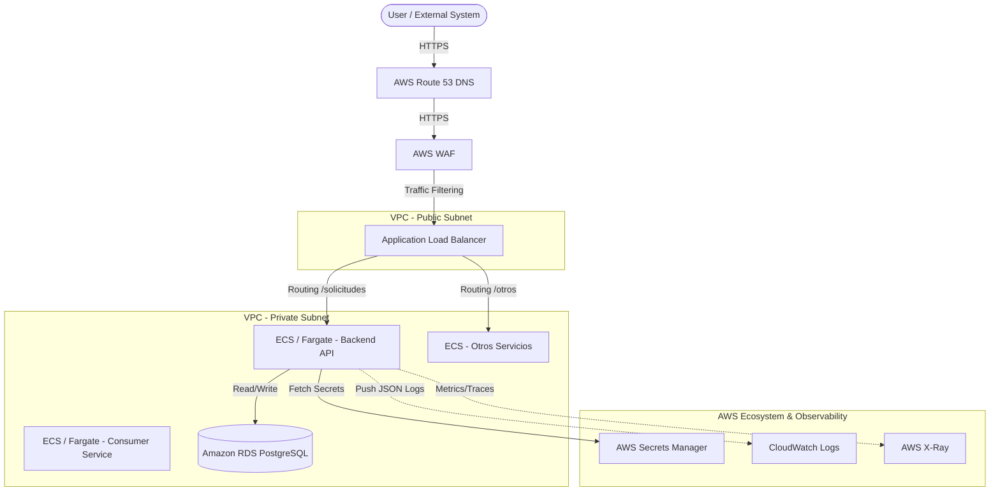

# Solicitudes Backend Service (Technical Test)

This repository contains the backend solution for institutional requests, following a clean, containerized, and scalable architecture.

## 🚀 Quickstart

**Prerequisites:** Docker and Docker Compose installed.

1. **Clone the repository.**
2. **Environment Setup:**
   ```bash
   cp .env.example .env
   ```
   *(Adjust variables in `.env` if necessary)*
3. **Run the solution:**
   ```bash
   docker compose up --build
   ```
4. **Access the API:**
   - Swagger Documentation: http://localhost:8000/docs
   - ReDoc: http://localhost:8000/redoc

### 🛑 Stopping the Services
```bash
docker compose down
# To remove volumes (reset database):
docker compose down -v
```

## 🧪 Testing

To run the automated test suite with `pytest`:
```bash
docker compose exec api pytest tests/
```

## 📐 Architecture & Technical Decisions

- **FastAPI**: Selected for its async capabilities, automatic OpenAPI generation, and speed.
- **Clean Layered Architecture**: 
  - `domain/`: Pure schemas and Enums.
  - `infrastructure/`: Database connection, models, and repositories (Data Access).
  - `api/`: API Routes/Endpoints.
  - `core/`: Logging and global exception handlers.
- **Structlog**: Used for JSON structured logging, which is essential for observability and central logging systems (e.g., ELK, Datadog).
- **Alembic**: Database migrations are automated and tracked. The `docker-compose` ensures `upgrade head` is run before the server starts.
- **Consumer Service**: A separate Python container that uses `requests` and `tenacity` to simulate a robust external system querying the API with exponential backoff for transient errors.

---

## ☁️ AWS Implementation Proposal

### 🏗️ Architecture Flowchart (Mermaid)



### 📝 Deployment Strategy

1. **Containers & Registry**: 
   - Docker images will be pushed to **Amazon ECR** (Elastic Container Registry).
   - Execution will be handled by **Amazon ECS with AWS Fargate** (Serverless compute for containers), removing the need to manage EC2 instances.
2. **Entrypoint & Security (Public Layer)**:
   - **Route 53** handles DNS.
   - **AWS WAF** (Web Application Firewall) protects against malicious traffic and applies rate limiting (e.g., max 100 requests per IP per minute).
   - **Application Load Balancer (ALB)** is placed in public subnets, acting as the single entry point. It handles SSL/TLS termination using certificates from **AWS Certificate Manager (ACM)**.
3. **Backend & Database (Private Layer)**:
   - The **FastAPI services** run in private subnets, completely isolated from direct internet access. The ALB forwards traffic to their Target Groups.
   - **Amazon RDS for PostgreSQL** (Multi-AZ for high availability) is placed in isolated data subnets. Only the ECS Security Groups can access the DB port (5432).
4. **Secrets Management**:
   - Environment variables like `POSTGRES_PASSWORD` will NEVER be stored in the image or ECS task definitions directly. We will use **AWS Secrets Manager**, which injects the secrets into the Fargate containers at runtime.
5. **Observability**:
   - Since we output JSON logs using `structlog`, **CloudWatch Logs** can automatically parse them for querying.
   - **AWS X-Ray** can be integrated for distributed tracing (trazabilidad) between microservices.
6. **Authentication & Authorization**:
   - Users from the frontend authenticate via **Amazon Cognito** (or external IdP). The ALB can be configured to validate JWT tokens before forwarding traffic, OR the validation can happen within each FastAPI service using a middleware.
   - For Service-to-Service communication, we apply the Principle of Least Privilege using **IAM Task Roles** for ECS, and mTLS or internal tokens if necessary.
7. **CI/CD & Reversion**:
   - A pipeline (e.g., GitHub Actions or AWS CodePipeline) will build the image, run `pytest`, push to ECR, and trigger an ECS rolling update.
   - If health checks fail during deployment, ECS automatically halts the rollout and keeps the old version running (Zero Downtime Deployment).
